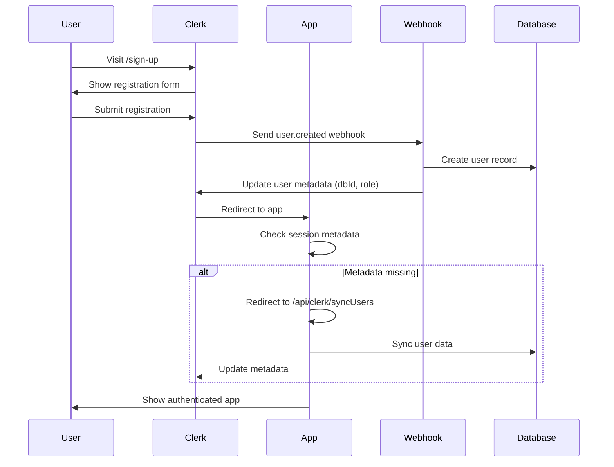
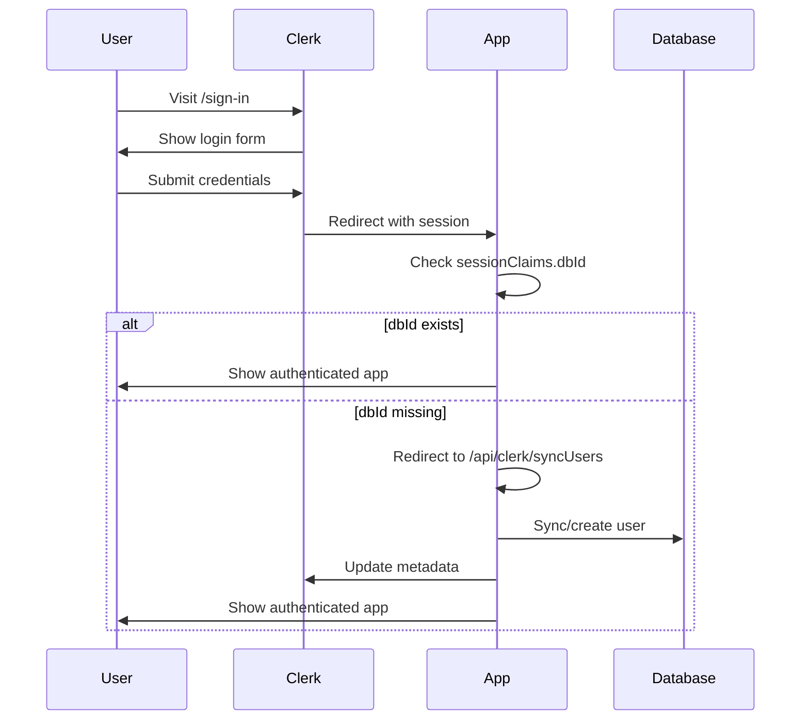

# Clerk Authentication Integration Documentation

This document provides a comprehensive overview of how Clerk authentication is integrated and works within this Next.js application, covering setup, user flows, database synchronization, and security patterns.

## Table of Contents

1. [Overview](#overview)
2. [Architecture](#architecture)
3. [Configuration](#configuration)
4. [Authentication Flow](#authentication-flow)
5. [Database Synchronization](#database-synchronization)
6. [User Interface Components](#user-interface-components)
7. [Route Protection](#route-protection)
8. [Role-Based Access Control](#role-based-access-control)
9. [Session Management](#session-management)
10. [Webhook Integration](#webhook-integration)
11. [Error Handling](#error-handling)
12. [Security Considerations](#security-considerations)

## Overview

The application uses Clerk as the primary authentication provider with a hybrid approach:

- **Clerk**: Handles authentication, session management, and user interface
- **Internal Database**: Stores extended user data and application-specific information
- **Synchronization**: Maintains consistency between Clerk and internal database

### Key Benefits

- 🔐 **Secure Authentication**: Industry-standard security with Clerk
- 🔄 **Real-time Sync**: Webhook-based synchronization
- 🎨 **Customizable UI**: Pre-built components with customization options
- 📱 **Multi-platform**: Works across web, mobile, and API
- 🛡️ **Role-based Access**: Integrated permission system

## Architecture

### System Architecture

```
┌─────────────────────────────────────────────────────────────────┐
│                        Frontend (Next.js)                      │
│  ┌─────────────────┐  ┌─────────────────┐  ┌─────────────────┐  │
│  │  Auth Pages     │  │  Protected      │  │  Public Pages   │  │
│  │  /sign-in       │  │  Routes         │  │  /              │  │
│  │  /sign-up       │  │  /admin         │  │                 │  │
│  └─────────────────┘  └─────────────────┘  └─────────────────┘  │
├─────────────────────────────────────────────────────────────────┤
│                     Clerk Authentication                        │
│  ┌─────────────────┐  ┌─────────────────┐  ┌─────────────────┐  │
│  │  Session Mgmt   │  │  User Metadata  │  │  Webhooks       │  │
│  │  JWT Tokens     │  │  dbId, role     │  │  Real-time Sync │  │
│  └─────────────────┘  └─────────────────┘  └─────────────────┘  │
├─────────────────────────────────────────────────────────────────┤
│                    Application Layer                            │
│  ┌─────────────────┐  ┌─────────────────┐  ┌─────────────────┐  │
│  │  Middleware     │  │  Services       │  │  API Routes     │  │
│  │  Route Guard    │  │  getCurrentUser │  │  /syncUsers     │  │
│  └─────────────────┘  └─────────────────┘  └─────────────────┘  │
├─────────────────────────────────────────────────────────────────┤
│                    Database Layer                               │
│  ┌─────────────────┐  ┌─────────────────┐  ┌─────────────────┐  │
│  │  User Table     │  │  Cache Layer    │  │  Relations      │  │
│  │  Extended Data  │  │  Performance    │  │  Courses, etc   │  │
│  └─────────────────┘  └─────────────────┘  └─────────────────┘  │
└─────────────────────────────────────────────────────────────────┘
```

## Configuration

### Environment Variables

#### Client-side Configuration

```typescript
// src/data/env/client.ts
export const env = createEnv({
  client: {
    NEXT_PUBLIC_CLERK_PUBLISHABLE_KEY: z.string().min(1), // Clerk public key
    NEXT_PUBLIC_CLERK_SIGN_IN_URL: z.string().min(1), // Sign-in page URL
    NEXT_PUBLIC_CLERK_SIGN_UP_URL: z.string().min(1), // Sign-up page URL
    NEXT_PUBLIC_STRIPE_PUBLISHABLE_KEY: z.string().min(1), // Payment integration
    NEXT_PUBLIC_SERVER_URL: z.string().min(1), // Server base URL
  },
});
```

#### Server-side Configuration

```typescript
// src/data/env/server.ts
export const env = createEnv({
  server: {
    CLERK_SECRET_KEY: z.string().min(1), // Clerk secret key for server operations
    CLERK_WEBHOOK_SECRET: z.string().min(1), // Webhook signature verification
    // Database configuration...
  },
});
```

### Clerk Provider Setup

```typescript
// src/app/layout.tsx
import { ClerkProvider } from "@clerk/nextjs";

export default function RootLayout({
  children,
}: {
  children: React.ReactNode;
}) {
  return (
    <ClerkProvider>
      <html lang="en">
        <body className="antialiased">{children}</body>
      </html>
    </ClerkProvider>
  );
}
```

### Middleware Configuration

```typescript
// src/middleware.ts
import { clerkMiddleware } from "@clerk/nextjs/server";

export default clerkMiddleware();

export const config = {
  matcher: [
    // Protect all routes except static files and Next.js internals
    "/((?!_next|[^?]*\\.(?:html?|css|js(?!on)|jpe?g|webp|png|gif|svg|ttf|woff2?|ico|csv|docx?|xlsx?|zip|webmanifest)).*)",
    // Always run for API routes
    "/(api|trpc)(.*)",
  ],
};
```

## Authentication Flow

### 1. User Registration Flow



### 2. User Login Flow



### 3. Session Validation Flow

```typescript
// src/services/clerk.ts
export async function getCurrentUser({ allData = false } = {}) {
  const { userId, sessionClaims, redirectToSignIn } = await auth();

  // If user exists in Clerk but not synced to database
  if (userId != null && sessionClaims.dbId == null) {
    redirect("/api/clerk/syncUsers");
  }

  return {
    clerkUserId: userId, // Clerk user identifier
    userId: sessionClaims?.dbId, // Internal database ID
    role: sessionClaims?.role, // User role from database
    user:
      allData && sessionClaims?.dbId != null
        ? await getUser(sessionClaims.dbId)
        : undefined,
    redirectToSignIn, // Function to redirect to sign-in
  };
}
```

## Database Synchronization

### Dual Synchronization Strategy

The application maintains user data in both Clerk and the internal database:

#### 1. Clerk → Database (Primary Flow)

```typescript
// Webhook handles Clerk events
switch (event.type) {
  case "user.created":
  case "user.updated":
    // Extract user data from Clerk
    const user = await insertUser({
      clerkUserId: event.data.id,
      email: event.data.email_addresses[0].email_address,
      name: `${event.data.first_name} ${event.data.last_name}`.trim(),
      imageUrl: event.data.image_url,
      role: "user",
    });

    // Sync metadata back to Clerk
    if (user) {
      await syncClerkUserMetadata(user);
    }
    break;
}
```

#### 2. Database → Clerk (Metadata Sync)

```typescript
// src/services/clerk.ts
export function syncClerkUserMetadata(user: {
  id: string;
  clerkUserId: string;
  role: UserRole;
}) {
  return client.users.updateUserMetadata(user.clerkUserId, {
    publicMetadata: {
      dbId: user.id, // Store internal database ID
      role: user.role, // Store user role for quick access
    },
  });
}
```

### User Synchronization Endpoint

```typescript
// src/app/api/clerk/syncUsers/route.ts
export async function GET(request: Request) {
  const user = await currentUser(); // Get current Clerk user

  if (!user) {
    return NextResponse.redirect(new URL("/sign-in", request.url));
  }

  // Extract user information
  const name =
    user.fullName || user.firstName || user.lastName || user.username || "User";
  const email = user.primaryEmailAddress?.emailAddress;

  // Upsert user in database
  const dbUser = await insertUser({
    clerkUserId: user.id,
    name,
    email,
    imageUrl: user.imageUrl,
    role: (user.publicMetadata?.role as "user" | "admin") ?? "user",
  });

  // Sync metadata back to Clerk
  if (dbUser) {
    await syncClerkUserMetadata(dbUser);
  }

  // Redirect to original destination
  const referer = request.headers.get("referer");
  const redirectUrl =
    referer && !referer.includes("/api/clerk/syncUsers") ? referer : "/";
  return NextResponse.redirect(redirectUrl);
}
```

## User Interface Components

### Authentication Pages

#### Sign-In Page

```typescript
// src/app/(auth)/sign-in/[[...sign-in]]/page.tsx
import { SignIn } from "@clerk/nextjs";

export default function Page() {
  return <SignIn />;
}
```

#### Sign-Up Page

```typescript
// src/app/(auth)/sign-up/[[...sign-up]]/page.tsx
import { SignUp } from "@clerk/nextjs";

export default function Page() {
  return <SignUp />;
}
```

#### Authentication Layout

```typescript
// src/app/(auth)/layout.tsx
export default function AuthLayout({
  children,
}: {
  children: React.ReactNode;
}) {
  return (
    <main className="min-h-screen flex flex-col justify-center items-center">
      {children}
    </main>
  );
}
```

### Navigation Components

```typescript
// Navigation with authentication state
function Navbar() {
  return (
    <header className="flex h-12 shadow bg-background z-10">
      <nav className="container flex gap-4">
        <Link
          href="/"
          className="mr-auto text-lg hover:underline px-2 flex items-center"
        >
          Courses Platform
        </Link>

        <SignedIn>
          <AdminLink />
          <Link
            href="/courses"
            className="hover:bg-accent/10 flex items-center px-2"
          >
            My Courses
          </Link>
          <Link
            href="/purchases"
            className="hover:bg-accent/10 flex items-center px-2"
          >
            Purchases History
          </Link>
          <div className="size-8 self-center">
            <UserButton
              appearance={{
                elements: {
                  userButtonAvatarBox: {
                    width: "100%",
                    height: "100%",
                  },
                },
              }}
            />
          </div>
        </SignedIn>

        <SignedOut>
          <Button asChild className="self-center">
            <SignInButton>Sign In</SignInButton>
          </Button>
        </SignedOut>
      </nav>
    </header>
  );
}
```

### Conditional Rendering Components

```typescript
// Clerk provides built-in components for conditional rendering
<SignedIn>
  {/* Content shown only to authenticated users */}
  <UserButton />
  <Link href="/dashboard">Dashboard</Link>
</SignedIn>

<SignedOut>
  {/* Content shown only to unauthenticated users */}
  <SignInButton>Sign In</SignInButton>
</SignedOut>
```

## Route Protection

### Automatic Route Protection

```typescript
// Middleware automatically protects routes
export default clerkMiddleware();

// Routes are protected by default, except:
// - Static files
// - Next.js internals
// - Explicitly public routes
```

### Manual Route Protection

```typescript
// In page components or API routes
export default async function ProtectedPage() {
  const user = await getCurrentUser();

  if (!user.userId) {
    // User will be redirected to sign-in automatically
    return null;
  }

  return <div>Protected content</div>;
}
```

### API Route Protection

```typescript
// API routes are automatically protected
export async function GET() {
  const { userId } = await auth();

  if (!userId) {
    return new Response("Unauthorized", { status: 401 });
  }

  // Protected API logic
}
```

## Role-Based Access Control

### Permission System

```typescript
// src/permissions/general.ts
export function canAccessAdminPages({ role }: { role: UserRole | undefined }) {
  return role === "admin";
}
```

### Role-Based Components

```typescript
// Conditional admin link
async function AdminLink() {
  const user = await getCurrentUser();

  if (!canAccessAdminPages(user)) return null;

  return (
    <Link href="/admin" className="hover:bg-accent/10 flex items-center px-2">
      Admin
    </Link>
  );
}
```

### Role Assignment

```typescript
// Roles are assigned during user creation
const dbUser = await insertUser({
  clerkUserId: user.id,
  name,
  email,
  imageUrl: user.imageUrl,
  role: (user.publicMetadata?.role as "user" | "admin") ?? "user", // Default to "user"
});
```

## Session Management

### Session Claims

```typescript
// Custom JWT session claims
declare global {
  interface CustomJwtSessionClaims {
    dbId?: string; // Internal database user ID
    role?: UserRole; // User role for authorization
  }
}
```

### Session Access

```typescript
// Access session data anywhere in the app
const { userId, sessionClaims } = await auth();

// userId: Clerk user ID
// sessionClaims.dbId: Internal database ID
// sessionClaims.role: User role
```

### Session Persistence

- **Client-side**: Automatic session management via Clerk
- **Server-side**: Session validation on every request
- **Database**: Extended user data persisted independently

## Webhook Integration

### Webhook Endpoint

```typescript
// src/app/api/webhooks/clerk/route.ts
export async function POST(req: Request) {
  // Verify webhook signature
  const wh = new Webhook(env.CLERK_WEBHOOK_SECRET);
  const event = wh.verify(body, headers) as WebhookEvent;

  switch (event.type) {
    case "user.created":
      // Create user in database
      const user = await insertUser({...});
      if (user) await syncClerkUserMetadata(user);
      break;

    case "user.updated":
      // Update user in database
      await updateUser({ clerkUserId: event.data.id }, {...});
      break;

    case "user.deleted":
      // Soft delete user
      await deleteUser({ clerkUserId: event.data.id });
      break;
  }

  return new Response("", { status: 200 });
}
```

### Webhook Events Handled

| Event          | Action             | Database Operation |
| -------------- | ------------------ | ------------------ |
| `user.created` | Create user record | `insertUser()`     |
| `user.updated` | Update user data   | `updateUser()`     |
| `user.deleted` | Soft delete user   | `deleteUser()`     |

### Webhook Security

```typescript
// Signature verification
const wh = new Webhook(env.CLERK_WEBHOOK_SECRET);
try {
  event = wh.verify(body, {
    "svix-id": svixId,
    "svix-timestamp": svixTimestamp,
    "svix-signature": svixSignature,
  }) as WebhookEvent;
} catch (err) {
  return new Response("Error occurred", { status: 400 });
}
```

## Error Handling

### Authentication Errors

```typescript
// Automatic redirect for unauthenticated users
if (userId != null && sessionClaims.dbId == null) {
  redirect("/api/clerk/syncUsers"); // Auto-sync missing data
}
```

### Sync Errors

```typescript
// Graceful error handling in sync endpoint
try {
  const dbUser = await insertUser({...});
} catch (error) {
  if (error instanceof Error && error.message.includes("password authentication failed")) {
    return new Response("Database connection failed", { status: 500 });
  }
  return new Response(`Sync failed: ${error.message}`, { status: 500 });
}
```

### Webhook Errors

```typescript
// Webhook signature verification errors
try {
  event = wh.verify(body, headers);
} catch (err) {
  console.error("Error verifying webhook:", err);
  return new Response("Error occurred", { status: 400 });
}
```

## Security Considerations

### 1. Environment Variables

- ✅ **Separation**: Client and server environment variables properly separated
- ✅ **Validation**: All environment variables validated with Zod schemas
- ✅ **Secrets**: Sensitive keys stored securely

### 2. Webhook Security

- ✅ **Signature Verification**: All webhooks cryptographically verified
- ✅ **HTTPS Only**: Webhooks only accepted over HTTPS
- ✅ **Secret Rotation**: Webhook secrets can be rotated

### 3. Session Security

- ✅ **JWT Tokens**: Secure token-based authentication
- ✅ **Automatic Expiry**: Sessions automatically expire
- ✅ **Secure Cookies**: HTTP-only, secure cookies

### 4. Data Protection

- ✅ **Soft Delete**: User data never permanently deleted
- ✅ **PII Redaction**: Personal information redacted on deletion
- ✅ **Minimal Data**: Only necessary data stored

### 5. Route Protection

- ✅ **Default Protection**: All routes protected by default
- ✅ **Middleware**: Automatic route protection via middleware
- ✅ **Role-based Access**: Fine-grained permission system

## Best Practices Implemented

### 1. **Hybrid Architecture**

- Clerk handles authentication complexity
- Internal database stores application-specific data
- Metadata synchronization maintains consistency

### 2. **Graceful Degradation**

- Automatic user synchronization on missing data
- Fallback mechanisms for sync failures
- Comprehensive error handling

### 3. **Performance Optimization**

- Cached user queries with proper invalidation
- Minimal database queries through smart caching
- Efficient upsert operations

### 4. **Developer Experience**

- Type-safe environment variables
- Comprehensive error messages
- Clear separation of concerns

### 5. **Security First**

- All routes protected by default
- Webhook signature verification
- Secure session management

## Troubleshooting Common Issues

### 1. User Not Synced

**Symptom**: User authenticated but no database record
**Solution**: User automatically redirected to `/api/clerk/syncUsers`

### 2. Missing Metadata

**Symptom**: `sessionClaims.dbId` is null
**Solution**: Sync endpoint updates Clerk metadata

### 3. Webhook Failures

**Symptom**: Users created in Clerk but not in database
**Solution**: Check webhook URL and secret configuration

### 4. Permission Issues

**Symptom**: Users can't access admin features
**Solution**: Verify role assignment and permission functions

This Clerk integration provides a robust, secure, and scalable authentication system that seamlessly integrates with your application's database and caching layers while maintaining excellent developer and user experience.
