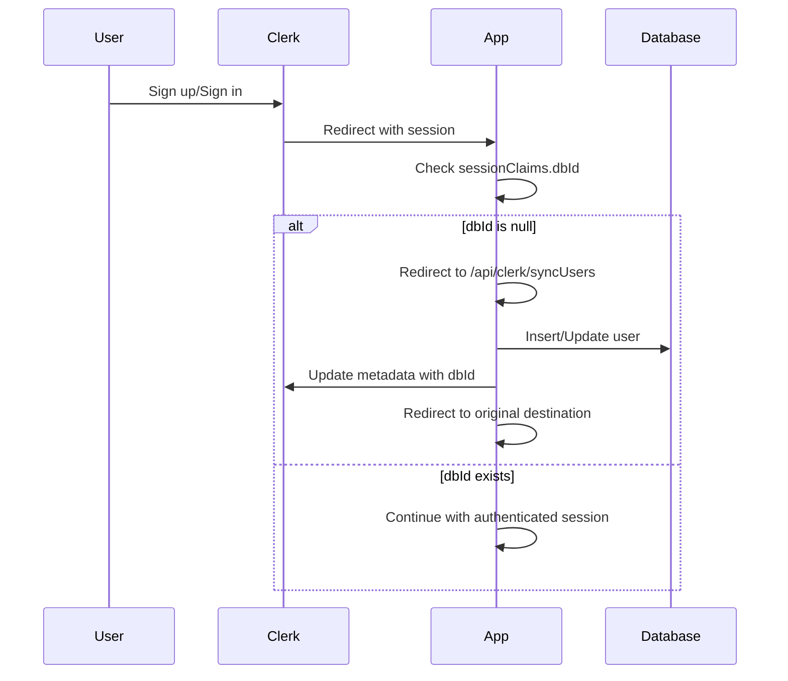
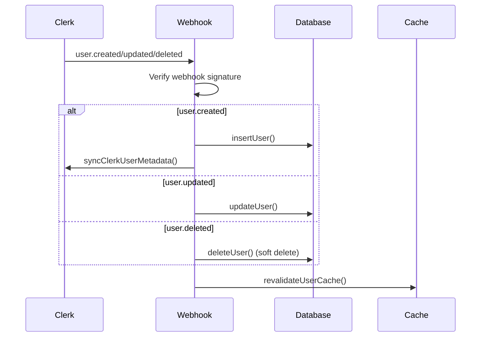

# User System Documentation

This document provides a comprehensive overview of the user management system in this Next.js application, covering authentication, database schema, caching, and all related functionality.

## Table of Contents

1. [Architecture Overview](#architecture-overview)
2. [Database Schema](#database-schema)
3. [Authentication with Clerk](#authentication-with-clerk)
4. [User Data Flow](#user-data-flow)
5. [Caching System](#caching-system)
6. [API Endpoints](#api-endpoints)
7. [Database Operations](#database-operations)
8. [Type Definitions](#type-definitions)
9. [Security & Permissions](#security--permissions)
10. [Error Handling](#error-handling)

## Architecture Overview

The user system is built on a multi-layered architecture:

- **Authentication Layer**: Clerk handles authentication and user sessions
- **Database Layer**: Drizzle ORM with PostgreSQL for user data persistence
- **Caching Layer**: Next.js cache with custom tagging for performance
- **API Layer**: RESTful endpoints for user synchronization and webhooks
- **Service Layer**: Business logic and data access patterns

### Key Components

```
┌─────────────────┐    ┌─────────────────┐    ┌─────────────────┐
│   Clerk Auth    │────│  Next.js App    │────│   Database      │
│                 │    │                 │    │   (PostgreSQL)  │
└─────────────────┘    └─────────────────┘    └─────────────────┘
         │                       │                       │
         │              ┌─────────────────┐              │
         └──────────────│  Cache Layer    │──────────────┘
                        │  (Next.js)      │
                        └─────────────────┘
```

## Database Schema

### User Table Structure

```typescript
// src/drizzle/schema/user.ts
export const UserTable = pgTable("users", {
  id: uuid().primaryKey().defaultRandom(), // Primary key (UUID)
  clerkUserId: text().notNull().unique(), // Clerk user ID (unique)
  name: text().notNull(), // User display name
  email: text().notNull(), // User email address
  role: userRoleEnum().notNull().default("user"), // User role (admin/user)
  imageUrl: text(), // Profile image URL
  deletedAt: timestamp({ withTimezone: true }), // Soft delete timestamp
  createdAt: timestamp({ withTimezone: true }).notNull().defaultNow(),
  updatedAt: timestamp({ withTimezone: true })
    .notNull()
    .defaultNow()
    .$onUpdate(() => new Date()),
});
```

### User Roles

```typescript
export const userRoles = ["admin", "user"] as const;
export type UserRole = (typeof userRoles)[number];
export const userRoleEnum = pgEnum("user_role", userRoles);
```

### Relationships

Users have relationships with:

- **UserCourseAccess**: Many-to-many relationship with courses
- **UserLessonComplete**: Tracking lesson completion status
- **Purchase**: User purchase history

```typescript
export const UserRelationships = relations(UserTable, ({ many }) => ({
  userCourseAccesses: many(UserCourseAccessTable),
}));
```

## Authentication with Clerk

### Clerk Integration

The application uses Clerk for authentication with custom metadata synchronization:

```typescript
// Custom JWT claims extend Clerk's session
interface CustomJwtSessionClaims {
  dbId?: string; // Internal database user ID
  role?: UserRole; // User role from database
}

interface UserPublicMetadata {
  dbId?: string; // Internal database user ID
  role?: UserRole; // User role from database
}
```

### Current User Service

```typescript
// src/services/clerk.ts
export async function getCurrentUser({ allData = false } = {}) {
  const { userId, sessionClaims, redirectToSignIn } = await auth();

  // If user exists in Clerk but not synced to database
  if (userId != null && sessionClaims.dbId == null) {
    redirect("/api/clerk/syncUsers");
  }

  return {
    clerkUserId: userId, // Clerk user ID
    userId: sessionClaims?.dbId, // Internal database ID
    role: sessionClaims?.role, // User role
    user:
      allData && sessionClaims?.dbId != null
        ? await getUser(sessionClaims.dbId)
        : undefined,
    redirectToSignIn,
  };
}
```

### Metadata Synchronization

```typescript
export function syncClerkUserMetadata(user: {
  id: string;
  clerkUserId: string;
  role: UserRole;
}) {
  return client.users.updateUserMetadata(user.clerkUserId, {
    publicMetadata: {
      dbId: user.id, // Store internal ID in Clerk
      role: user.role, // Store role in Clerk
    },
  });
}
```

## User Data Flow

### 1. User Registration/Login Flow



### 2. Webhook Synchronization Flow



## Caching System

### Cache Strategy

The application implements a sophisticated caching system using Next.js cache tags:

```typescript
// src/features/users/db/cache.ts
export function getUserGlobalTag() {
  return getGlobalTag("users"); // "global:users"
}

export function getUserIdTag(id: string) {
  return getIdTag("users", id); // "id:{id}-users"
}

export function revalidateUserCache(id: string) {
  revalidateTag(getUserGlobalTag()); // Invalidate all user queries
  revalidateTag(getUserIdTag(id)); // Invalidate specific user queries
}
```

### Cache Tags Structure

```typescript
// src/lib/dataCache.ts
type CACHE_TAG = "users" | "courses" | "userCourseAccess" | /* ... */;

export function getGlobalTag(tag: CACHE_TAG) {
  return `global:${tag}` as const;        // Global cache for entity type
}

export function getIdTag(tag: CACHE_TAG, id: string) {
  return `id:${id}-${tag}` as const;      // Specific entity cache
}

export function getUserTag(tag: CACHE_TAG, userId: string) {
  return `user:${userId}-${tag}` as const; // User-specific cache
}
```

### Cached User Queries

```typescript
async function getUser(id: string) {
  "use cache"; // Next.js cache directive
  cacheTag(getUserIdTag(id)); // Tag for cache invalidation

  return db.query.UserTable.findFirst({
    where: eq(UserTable.id, id),
  });
}
```

## API Endpoints

### 1. User Synchronization Endpoint

**Endpoint**: `GET /api/clerk/syncUsers`

**Purpose**: Synchronizes Clerk users with the internal database

```typescript
// src/app/api/clerk/syncUsers/route.ts
export async function GET(request: Request) {
  const user = await currentUser(); // Get current Clerk user

  if (!user) {
    return NextResponse.redirect(new URL("/sign-in", request.url));
  }

  // Extract user data from Clerk
  const name =
    user.fullName || user.firstName || user.lastName || user.username || "User";
  const email = user.primaryEmailAddress?.emailAddress;

  // Insert/update user in database
  const dbUser = await insertUser({
    clerkUserId: user.id,
    name,
    email,
    imageUrl: user.imageUrl,
    role: (user.publicMetadata?.role as "user" | "admin") ?? "user",
  });

  // Sync metadata back to Clerk
  if (dbUser) {
    await syncClerkUserMetadata(dbUser);
  }

  // Redirect to original destination
  const referer = request.headers.get("referer");
  const redirectUrl =
    referer && !referer.includes("/api/clerk/syncUsers") ? referer : "/";
  return NextResponse.redirect(redirectUrl);
}
```

### 2. Clerk Webhook Endpoint

**Endpoint**: `POST /api/webhooks/clerk`

**Purpose**: Handles Clerk webhook events for user lifecycle management

```typescript
// src/app/api/webhooks/clerk/route.ts
export async function POST(req: Request) {
  // Verify webhook signature
  const wh = new Webhook(env.CLERK_WEBHOOK_SECRET);
  const event = wh.verify(body, headers) as WebhookEvent;

  switch (event.type) {
    case "user.created":
    case "user.updated":
      // Extract user data and sync to database
      const user = await insertUser({...});
      if (user) await syncClerkUserMetadata(user);
      break;

    case "user.deleted":
      // Soft delete user
      await deleteUser({ clerkUserId: event.data.id });
      break;
  }
}
```

## Database Operations

### User CRUD Operations

```typescript
// src/features/users/db/users.ts

// Create or Update User (Upsert)
export async function insertUser(data: typeof UserTable.$inferInsert) {
  const [newUser] = await db
    .insert(UserTable)
    .values(data)
    .returning()
    .onConflictDoUpdate({
      target: [UserTable.clerkUserId], // Conflict on clerkUserId
      set: data, // Update with new data
    });

  if (!newUser) throw new Error("Failed to create user");

  revalidateUserCache(newUser.id); // Invalidate cache
  return newUser;
}

// Update User
export async function updateUser(
  { clerkUserId }: { clerkUserId: string },
  data: Partial<typeof UserTable.$inferInsert>
) {
  const [updatedUser] = await db
    .update(UserTable)
    .set(data)
    .where(eq(UserTable.clerkUserId, clerkUserId))
    .returning();

  if (!updatedUser) throw new Error("Failed to update user");

  revalidateUserCache(updatedUser.id);
  return updatedUser;
}

// Soft Delete User
export async function deleteUser({ clerkUserId }: { clerkUserId: string }) {
  const [deletedUser] = await db
    .update(UserTable)
    .set({
      deletedAt: new Date(), // Mark as deleted
      email: "redacted@deleted.com", // Redact PII
      name: "Deleted User", // Redact PII
      clerkUserId: "deleted", // Redact Clerk ID
      imageUrl: null, // Remove image
    })
    .where(eq(UserTable.clerkUserId, clerkUserId))
    .returning();

  if (!deletedUser) throw new Error("Failed to delete user");

  revalidateUserCache(deletedUser.id);
  return deletedUser;
}
```

### Key Features of Database Operations

1. **Upsert Pattern**: `insertUser` uses `onConflictDoUpdate` to handle both creation and updates
2. **Soft Delete**: Users are never hard-deleted; instead, PII is redacted and `deletedAt` is set
3. **Cache Invalidation**: Every operation invalidates relevant cache tags
4. **Error Handling**: All operations include proper error handling with descriptive messages
5. **Returning Clause**: All operations return the affected row for confirmation

## Type Definitions

### Inferred Types

```typescript
// Database types are inferred from schema
type User = typeof UserTable.$inferSelect;
type NewUser = typeof UserTable.$inferInsert;

// Example User object:
const user: User = {
  id: "uuid-string",
  clerkUserId: "clerk_user_id",
  name: "John Doe",
  email: "john@example.com",
  role: "user",
  imageUrl: "https://...",
  deletedAt: null,
  createdAt: new Date(),
  updatedAt: new Date(),
};
```

### Custom Type Extensions

```typescript
// Clerk type extensions
declare global {
  interface CustomJwtSessionClaims {
    dbId?: string; // Internal database ID
    role?: UserRole; // User role
  }

  interface UserPublicMetadata {
    dbId?: string; // Internal database ID
    role?: UserRole; // User role
  }
}
```

## Security & Permissions

### Role-Based Access Control

```typescript
export const userRoles = ["admin", "user"] as const;
export type UserRole = (typeof userRoles)[number];

// Role is stored in both database and Clerk metadata
// Database is source of truth, Clerk metadata is for performance
```

### Data Protection

1. **Soft Delete**: Users are never permanently deleted
2. **PII Redaction**: Personal information is redacted on deletion
3. **Webhook Verification**: All webhook requests are cryptographically verified
4. **Environment Variables**: Sensitive data stored in environment variables

### Middleware Protection

```typescript
// src/middleware.ts
export default clerkMiddleware();

// Protects all routes except static files and Next.js internals
export const config = {
  matcher: [
    "/((?!_next|[^?]*\\.(?:html?|css|js(?!on)|jpe?g|webp|png|gif|svg|ttf|woff2?|ico|csv|docx?|xlsx?|zip|webmanifest)).*)",
    "/(api|trpc)(.*)",
  ],
};
```

## Error Handling

### Database Operation Errors

```typescript
// All database operations include comprehensive error handling
try {
  const user = await insertUser(data);
} catch (error) {
  if (
    error instanceof Error &&
    error.message.includes("password authentication failed")
  ) {
    return new Response(
      "Database connection failed. Please check your database is running and credentials are correct.",
      { status: 500 }
    );
  }
  return new Response(
    `Sync failed: ${error instanceof Error ? error.message : "Unknown error"}`,
    { status: 500 }
  );
}
```

### Webhook Error Handling

```typescript
// Webhook signature verification
try {
  event = wh.verify(body, headers) as WebhookEvent;
} catch (err) {
  console.error("Error verifying webhook:", err);
  return new Response("Error occurred", { status: 400 });
}
```

### User Sync Error Handling

```typescript
// Graceful handling of missing user data
if (!email) {
  console.error("User email missing");
  return new Response("User email missing", { status: 500 });
}

if (!name) {
  return new Response("No name", { status: 400 });
}
```

## Best Practices & Patterns

### 1. Cache-First Architecture

- All user queries are cached with appropriate tags
- Cache is invalidated on every mutation
- Global and specific cache tags for granular control

### 2. Eventual Consistency

- Clerk is the authentication source of truth
- Database is the user data source of truth
- Metadata synchronization ensures consistency

### 3. Defensive Programming

- All operations include null checks and error handling
- Graceful degradation when services are unavailable
- Comprehensive logging for debugging

### 4. Privacy by Design

- Soft delete preserves referential integrity
- PII redaction on user deletion
- Minimal data collection and storage

### 5. Performance Optimization

- Cached queries reduce database load
- Efficient upsert operations
- Lazy loading of user data when needed

## Troubleshooting Common Issues

### 1. User Not Synced to Database

**Symptom**: User authenticated in Clerk but `sessionClaims.dbId` is null
**Solution**: User will be automatically redirected to `/api/clerk/syncUsers`

### 2. Cache Stale Data

**Symptom**: User data not updating after changes
**Solution**: Check that `revalidateUserCache()` is called after mutations

### 3. Webhook Failures

**Symptom**: Users created in Clerk but not in database
**Solution**: Check webhook endpoint configuration and signature verification

### 4. Database Connection Issues

**Symptom**: "password authentication failed" errors
**Solution**: Verify database credentials and connection string in environment variables

This comprehensive user system provides a robust foundation for user management with authentication, caching, and data persistence while maintaining security and performance best practices.
